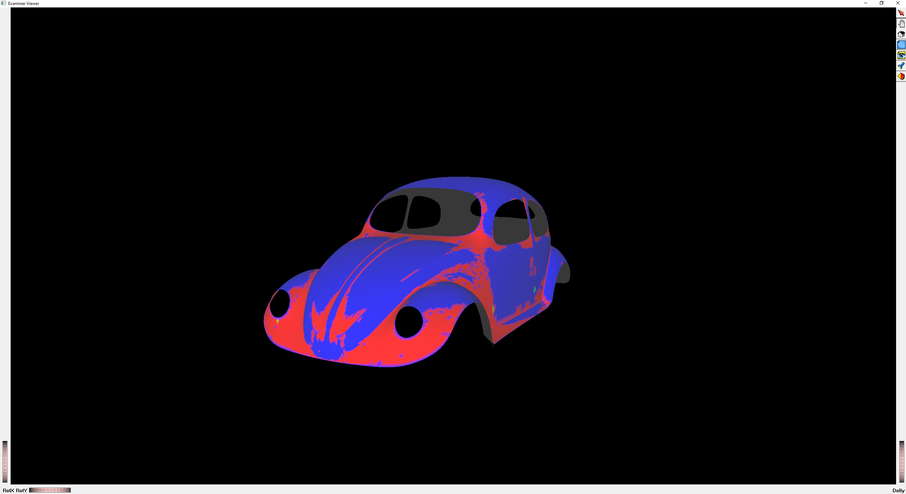
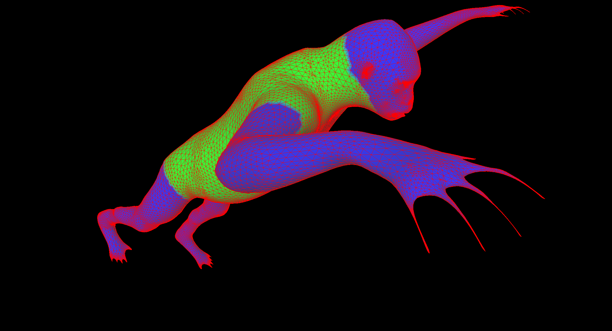
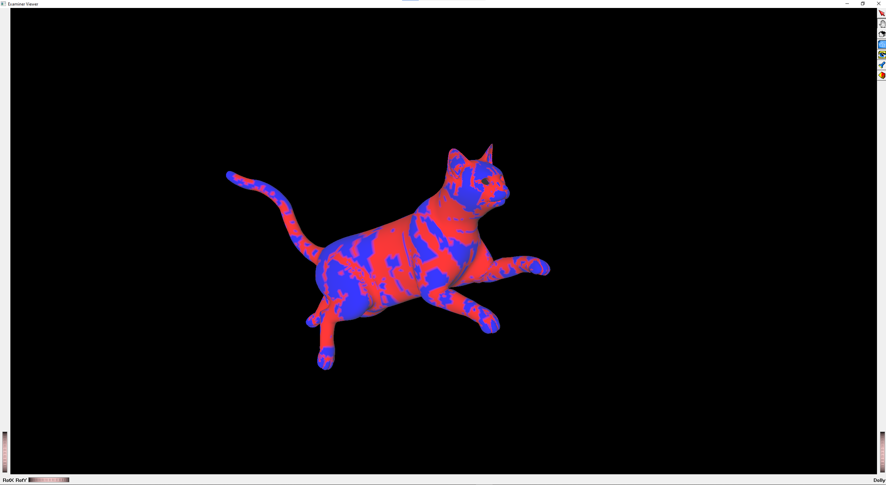
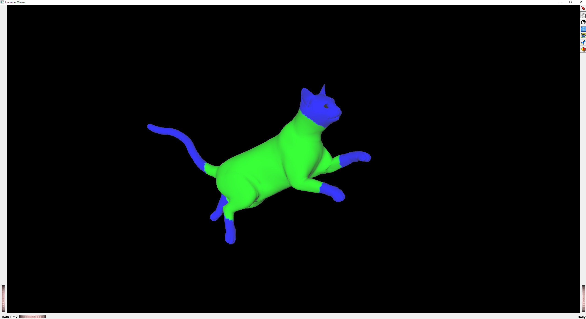

# Digital-Geometry-Processing

This repository contains the implementation of my first Digital Geometry Processing course assignment, focusing on geodesic distances, descriptors (Gaussian curvature and average geodesic distance), farthest point sampling, and Laplacian smoothing. The assignment is based on the Dijkstra's Shortest Path algorithm and utilizes the Coin3D Open Inventor renderer for visualization.


<center> Geodesic paths on the beetle model. </center>

## Introduction

In this assignment, we explore various concepts and techniques in digital geometry processing. The main objectives include:

- Computing geodesic distances between vertices on a mesh using the Dijkstra's Shortest Path algorithm.
- Calculating descriptors such as Gaussian curvature and average geodesic distance for each vertex.
- Visualizing the geodesic paths between query points on the mesh.
- Sampling points using farthest point sampling (FPS) and computing geodesic distances to the samples.
- Smoothing the models using Laplacian smoothing and displacement vectors.
- Coloring triangles based on the quality using the circum-radius to minimum edge length ratio.

<br>


<center> Gaussian curvature on the beetle model. </center>

## Features
The assignment implementation includes the following features:

- Computation of geodesic distances between mesh vertices using Dijkstra's algorithm. The algorithm is implemented using a array, min-heap, and fibonacci heap.
- Calculation of Gaussian curvature and average geodesic distance for each vertex.
- Visualization of geodesic paths between query points on the mesh.
- Sampling of points using farthest point sampling (FPS) and computing geodesic distances to the samples.
- Smoothing of models using Laplacian smoothing and displacement vectors.
- Coloring of triangles based on quality using the circum-radius to minimum edge length ratio.
- Supports the .off file format for representing input meshes.  

## Getting Started
To get started with the assignment, follow these steps:

- Clone this repository to your local machine.
- The required dependencies are included in the SourceCode folder, including Coin3D Open Inventor. 
- You may need to change the include paths in the project settings to match the location of the dependencies on your machine. 
- Build the project with Visual Studio 2022 and run.

## Usage
To use the assignment implementation, follow these steps:

- Build the project according to the provided build instructions.
- Run the program and provide the necessary input, such as the input mesh file. You can change the input mesh by modifying the input file path in the main function. 
- The program will ask you which operation you would like to perform. You can choose to compute geodesic distances, descriptors, perform sampling, and apply Laplacian smoothing. 
- Visualize the results using the Coin3D Open Inventor renderer, which will display the mesh with colored vertices and geodesic paths.


## Time Comparison
The assignment includes the implementation of the Dijkstra's Shortest Path algorithm using three different data structures: array, min-heap, and Fibonacci heap. For example, the following are the time comparisons for each implementation on the "gorilla.off" mesh:
```
Dijkstra's Algorithm with Array Implementation: 327.535 seconds
Dijkstra's Algorithm with Min-Heap Implementation: 0.228674 seconds
Dijkstra's Algorithm with Fibonacci Heap Implementation: 0.197461 seconds
```

## Results



<center> Laplacian smoothing on the gorilla model. </center>
<br>


<center> Gaussian curvature on the cat model. </center>
<br>


<center> Average geodesic distance on the cat model. </center>

